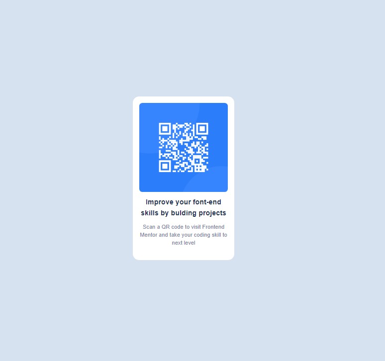

# Frontend Mentor - QR code component solution

This is a solution to the [QR code component challenge on Frontend Mentor](https://www.frontendmentor.io/challenges/qr-code-component-iux_sIO_H).

## Table of contents

- [Overview](#overview)
  - [Screenshot](#screenshot)
  - [Links](#links)
- [My process](#my-process)
  - [Built with](#built-with)
  - [What I learned](#what-i-learned)
  - [Continued development](#continued-development)
  - [Useful resources](#useful-resources)
- [Author](#author)
- [Acknowledgments](#acknowledgments)

**Note: Delete this note and update the table of contents based on what sections you keep.**

## Overview

### Screenshot



### Links

- Solution URL: [Github Link](https://your-solution-url.com)
- Live Site URL: [Live site URL](https://your-live-site-url.com)

## My process

### Built with

- Semantic HTML5 markup
- CSS custom properties
- Flexbox
- Mobile-first workflow
- [Tailwind CSS](https://tailwindcss.com/docs/installation)

### What I learned

So, this was my first time using Tailwind CSS for creating any component, I did this solution just to get the taste of tailwind CSS and it's really good, am looking forward to use it in my other projects as well specially integrating it with React.

The first quesiton came in my mind when I heard about Tailwind CSS is how will I put my custom CSS specially Font-Families and colors in it if everything is pre-defined but it was awsome exploring it.

```css
@import url('https://fonts.googleapis.com/css2?family=Outfit:wght@100..900&display=swap');


@layer utilities{
  .myfont{
    font-family: "Outfit", sans-serif;
  }
  .font-small{
    font-weight: 400;
  }
  .font-large{
    font-weight: 700;
  }
  .clr-bg-white{
    background-color:hsl(0,0%,100%);
  }
  .clr-bg-gray{
    background-color:hsl(212,45%,89%);
  }
  .clr-lg-blue{
    color:hsl(220,15%,55%);
  }
  .clr-blue{
    color:hsl(218,44%,22%);
  }
}
```
And this is the answer...wow!

### Continued development

I am too exited to explore Tailwind, I still don't have any idea how will I use Animation and Transition and all kinds of things.


### Useful resources

- [Tailwind Play](https://play.tailwindcss.com/) - I created my component here first...and it was a great experience, I'll continue to use it untill I get comfortable in using Tailwind CSS.

- [Chat GPT](https://chat.openai.com) - The best thing you can do is to use this Thing...

## Author

- Frontend Mentor - [@its-subhash](https://www.frontendmentor.io/profile/its-subhash)

